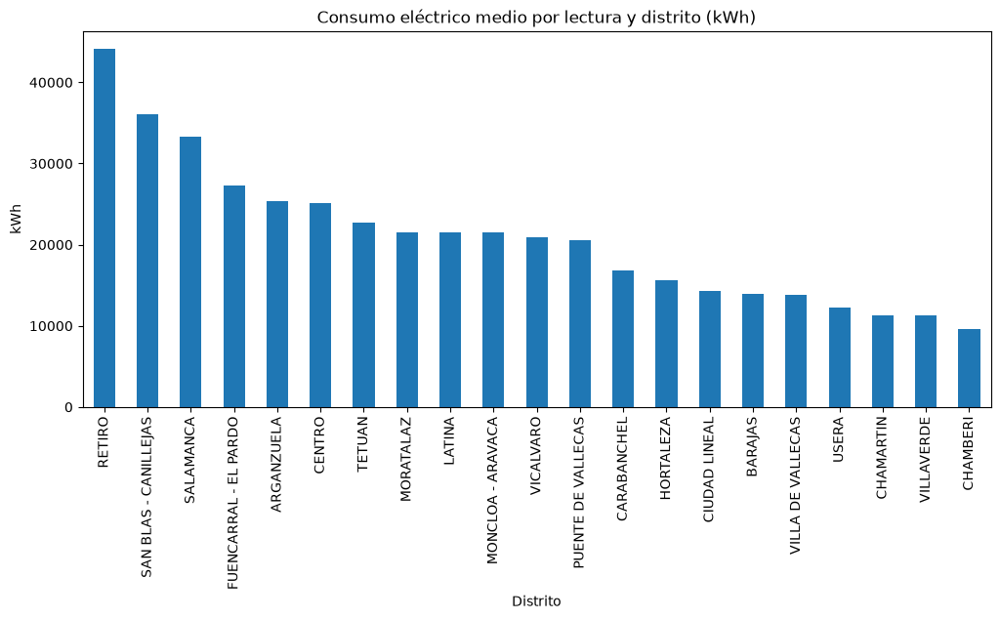

# Consumo energético de edificios municipales de Madrid

**Fuente:** [Portal de datos abiertos del Ayuntamiento de Madrid](https://datos.madrid.es/), conjunto "Consumo de energía en edificios municipales. Datos mensuales". El CSV se incluye en la carpeta (`consumo_energia_edificios.csv`) porque el portal cambia la dirección del archivo. Consumo mensual por sensor en los edificios municipales monitorizados desde 2020 (35.412 lecturas y 20 columnas en la versión incluida, de 2020 a 2025).

## Pasos
1. Se filtran las lecturas eléctricas (`kWh`) de los 21 distritos.
2. **Limpieza de `CONSUMO`:** los textos ("SIN DATOS…", "NO DATA"…) pasan a nulos, la coma decimal se cambia por punto y se descartan las lecturas negativas.
3. **Normalización z-score** del consumo dentro de cada distrito y año.
4. **Clasificación de eficiencia** con `pd.cut` en 5 tramos por percentiles: de "Muy eficiente" a "Ineficiente".
5. Gráfico del consumo medio por distrito y exportación a CSV.

**Resultado:** 15.843 lecturas válidas clasificadas. Retiro, San Blas-Canillejas y Salamanca tienen el mayor consumo medio por lectura; Chamberí, Villaverde y Chamartín, el menor.

## Qué cambió al revisarlo
- `dropna()` sin columnas descartaba toda fila con `GRUPO` vacío, es decir, la mayoría de los datos (quedaban 1.219 lecturas; ahora son 15.843). Ahora solo se descartan las lecturas sin consumo.
- Se filtran las lecturas negativas, que son errores del contador.
- Se corrigió una variable mal nombrada en el cálculo de los percentiles (`percentiles` → `df_percentiles`).
- Se descartan 3 filas con un distrito que no es real ("PROCESADO", "#N/D").
- El CSV se incluye en la carpeta y se lee con `utf-8-sig`, porque trae BOM. El portal cambió el enlace de descarga.
- Se añadieron título y ejes al gráfico y una sección de limitaciones.
